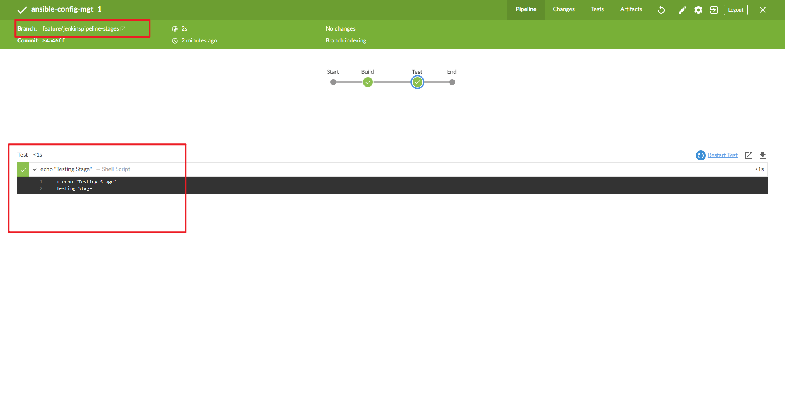

## **EXPERIENCE CONTINUOUS INTEGRATION WITH JENKINS | ANSIBLE | ARTIFACTORY | SONARQUBE | PHP**
===============================================================


## **Project Description:**


In this project, I will be setting up a CI/CD Pipeline for a PHP based application. The overall CI/CD process looks like the architecture above.

This project is architected in two major repositories with each repository containing its own CI/CD pipeline written in a Jenkinsfile

* ansible-config-mgt REPO: this repository contains JenkinsFile which is responsible for setting up and configuring infrastructure required to carry out processes required for our application to run. It does this through the use of ansible roles. This repo is infrastructure specific
  
* PHP-todo REPO : this repository contains jenkinsfile which is focused on processes which are application build specific such as building, linting, static code analysis, push to artifact repository etc.


## **Pre-requisites**

Will be making use of AWS virtual machines for this and will require 6 servers for the project which includes: Nginx Server: This would act as the reverse proxy server to our site and tool.

**Jenkins server:** To be used to implement your CI/CD workflows or pipelines. Select a t2.medium at least, Ubuntu 20.04 and Security group should be open to port 8080

**SonarQube server:** To be used for Code quality analysis. Select a t2.medium at least, Ubuntu 20.04 and Security group should be open to port 9000

**Artifactory server:** To be used as the binary repository where the outcome of your build process is stored. Select a t2.medium at least and Security group should be open to port 8081

**Database server:** To server as the databse server for the Todo application

**Todo webserver:** To host the Todo web application.


Ansible Inventory should look like this

```
├── ci
├── dev
├── pentest
├── pre-prod
├── prod
├── sit
└── uat
```

ci inventory file

```
[jenkins]
<Jenkins-Private-IP-Address>

[nginx]
<Nginx-Private-IP-Address>

[sonarqube]
<SonarQube-Private-IP-Address>

[artifact_repository]
<Artifact_repository-Private-IP-Address>
```

dev Inventory file

```
[tooling]
<Tooling-Web-Server-Private-IP-Address>

[todo]
<Todo-Web-Server-Private-IP-Address>

[nginx]
<Nginx-Private-IP-Address>

[db:vars]
ansible_user=ec2-user
ansible_python_interpreter=/usr/bin/python

[db]
<DB-Server-Private-IP-Address>
```

pentest inventory file

```
[pentest:children]
pentest-todo
pentest-tooling

[pentest-todo]
<Pentest-for-Todo-Private-IP-Address>

[pentest-tooling]
<Pentest-for-Tooling-Private-IP-Address>
```


## **ANSIBLE ROLES FOR CI ENVIRONMENT**

Now we go ahead and Add two more roles to ansible:

1. SonarQube (Scroll down to the Sonarqube section to see instructions on how to set up and configure SonarQube manually)

Why do we need SonarQube?
SonarQube is an open-source platform developed by SonarSource for continuous inspection of code quality, it is used to perform automatic reviews with static analysis of code to detect bugs, code smells, and security vulnerabilities.

2. Artifactory

Artifactory is a product by JFrog that serves as a binary repository manager. The binary repository is a natural extension to the source code repository, in that the outcome of your build process is stored. It can be used for certain other automation, but we will it strictly to manage our build artifacts.


Configuring Ansible For Jenkins Deployment

In previous projects, you have been launching Ansible commands manually from a CLI. Now, with Jenkins, we will start running Ansible from Jenkins UI.

To do this,

1. Navigate to Jenkins URL

2. Install & Open Blue Ocean Jenkins Plugin

3. Create a new pipeline


4. Select Github


5. Connect Jenkins with GitHub

6. Login to GitHub & Generate an Access Token

7. Copy Access Token


8. Paste the token and connect

9.  Create a new Pipeline


At this point you may not have a Jenkinsfile in the Ansible repository, so Blue Ocean will attempt to give you some guidance to create one. But we do not need that. We will rather create one ourselves. So, click on Administration to exit the Blue Ocean console.

### **Let us create our Jenkinsfile**

Inside the Ansible project, create a new directory `deploy` and start a new file `Jenkinsfile` inside the directory.


Add the code snippet below to start building the `Jenkinsfile` gradually. This pipeline currently has just one stage called Build and the only thing we are doing is using the `shell script` module to echo `Building Stage`

```
pipeline {
    agent any

  stages {
    stage('Build') {
      steps {
        script {
          sh 'echo "Building Stage"'
        }
      }
    }
    }
}
```

Now go back into the Ansible pipeline in Jenkins, and select configure


Back to the pipeline again, this time click "Build now"


This will trigger a build and you will be able to see the effect of our basic `Jenkinsfile` configuration by going through the console output of the build.

To really appreciate and feel the difference of Cloud Blue UI, it is recommended to try triggering the build again from Blue Ocean interface.

1. Click on Blue Ocean

2. Select your project

3. Click on the play button against the branch


Let us see this in action.

1. Create a new git branch and name it `feature/jenkinspipeline-stages`

2. Currently we only have the `Build` stage. Let us add another stage called `Test`. Paste the code snippet below and push the new changes to GitHub.

```
   pipeline {
    agent any

  stages {
    stage('Build') {
      steps {
        script {
          sh 'echo "Building Stage"'
        }
      }
    }

    stage('Test') {
      steps {
        script {
          sh 'echo "Testing Stage"'
        }
      }
    }
    }
}
```

3. To make your new branch show up in Jenkins, we need to tell Jenkins to scan the repository.

4. Navigate to the Ansible project and click on "Scan repository now"

5. Refresh the page and both branches will start building automatically. You can go into Blue Ocean and see both branches there too.

6. In Blue Ocean, you can now see how the Jenkinsfile has caused a new step in the pipeline launch build for the new branch




