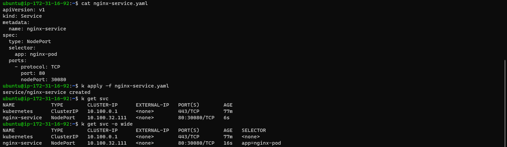
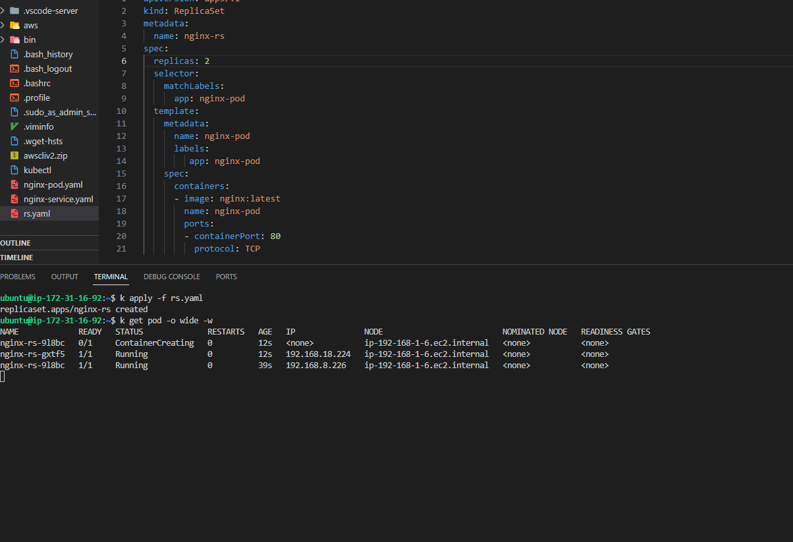

# DEPLOYING APPLICATIONS INTO KUBERNETES CLUSTER

## INTRODUCTION

This project demonstrates how containerised applications are deployed as pods in Kubernetes and how to access the application from the browser.

Create cluster using AWS EKS using the following link [here](https://github.com/weaveworks/eksctl)


##  STEP 1: Creating A Pod For The Nginx Application

- Creating nginx pod by applying the manifest file:

`nginx-pod.yaml` manifest file shown below

```
apiVersion: v1
kind: Pod
metadata:
  name: nginx-pod
  labels: 
    app: nginx-pod
spec:
  containers:
  - image: nginx:latest
    name: nginx-pod
    ports:
    - containerPort: 80
      protocol: TCP
```

`kubectl apply -f nginx-pod.yaml`

`kubectl get pods`

`kubectl describe pod nginx-pod`


## ACCESSING THE APP FROM THE BROWSER

Now you have a running Pod. What’s next?

The ultimate goal of any solution is to access it either through a web portal or some application (e.g., mobile app). We have a Pod with Nginx container, so we need to access it from the browser. But all you have is a running Pod that has its own IP address which cannot be accessed through the browser. To achieve this, we need another Kubernetes object called Service to accept our request and pass it on to the Pod.

A service is an object that accepts requests on behalf of the Pods and forwards it to the Pod’s IP address. If you run the command below, you will be able to see the Pod’s IP address. But there is no way to reach it directly from the outside world.

`kubectl get pod nginx-pod  -o wide`


Let us create a service to access the **Nginx Pod**

1. Create a Service yaml manifest file:

```
sudo cat <<EOF | sudo tee ./nginx-service.yaml
apiVersion: v1
kind: Service
metadata:
  name: nginx-service
spec:
  selector:
    app: nginx-pod 
  ports:
    - protocol: TCP
      port: 80
      targetPort: 80
EOF
```
2. Create a nginx-service resource by applying your manifest

`kubectl apply -f nginx-service.yaml`

output:

```
service/nginx-service created
```


check the public IP address of the worker node the pod is running on


# CREATE A REPLICA SET

Let us create a `rs.yaml` manifest for a ReplicaSet object:

```
apiVersion: apps/v1
kind: ReplicaSet
metadata:
  name: nginx-rs
  labels:
    app: nginx-pod
    tier: frontend
spec:
  replicas: 2
  selector:
    matchLabels:
      tier: frontend
  template:
    metadata:
      name: nginx-pod
      labels:
         app: nginx-pod
         tier: frontend
    spec:
      containers:
      - image: nginx:latest
        name: nginx-pod
        ports:
        - containerPort: 80
          protocol: TCP
```

`kubectl apply -f rs.yaml`




## USING AWS LOAD BALANCER TO ACCESS YOUR SERVICE IN KUBERNETES.

Note: You will only be able to test this using AWS EKS. You don not have to set this up in current project yet. In the next project, you will update your Terraform code to build an EKS cluster.

You have previously accessed the Nginx service through ClusterIP, and NodeIP, but there is another service type – Loadbalancer. This type of service does not only create a Service object in K8s, but also provisions a real external Load Balancer (e.g. Elastic Load Balancer – ELB in AWS)

To get the experience of this service type, update your service manifest and use the LoadBalancer type. Also, ensure that the selector references the Pods in the replica set.

```
apiVersion: v1
kind: Service
metadata:
  name: nginx-service
spec:
  type: LoadBalancer
  selector:
    tier: frontend
  ports:
    - protocol: TCP
      port: 80 # This is the port the Loadbalancer is listening at
      targetPort: 80 # This is the port the container is listening at
```
Apply the configuration:
```
kubectl apply -f nginx-service.yaml
```
Get the newly created service :
```
kubectl get service nginx-service
```


A clusterIP key is updated in the manifest and assigned an IP address. Even though you have specified a Loadbalancer service type, internally it still requires a clusterIP to route the external traffic through.

In the ports section, nodePort is still used. This is because Kubernetes still needs to use a dedicated port on the worker node to route the traffic through. Ensure that port range `30000-32767` is opened in your inbound Security Group configuration.

copy and paste the load balancer dns in your browser


## USING DEPLOYMENT CONTROLLERS

Do not Use Replication Controllers – Use Deployment Controllers Instead
Kubernetes is loaded with a lot of features, and with its vibrant open source community, these features are constantly evolving and adding up.

Previously, you have seen the improvements from ReplicationControllers (RC), to ReplicaSets (RS). In this section you will see another K8s object which is highly recommended over Replication objects (RC and RS).

Delete the ReplicaSet
```
kubectl delete rs nginx-rs
```

Create a  `deployment.yaml` manifest

```
apiVersion: apps/v1
kind: Deployment
metadata:
  name: nginx-deployment
  labels:
    tier: frontend
spec:
  replicas: 3
  selector:
    matchLabels:
      tier: frontend
  template:
    metadata:
      labels:
        tier: frontend
    spec:
      containers:
      - name: nginx
        image: nginx:latest
        ports:
        - containerPort: 80
```
create the deployment using:
```
kubectl apply -f deployment.yaml
```


Exec into one of the Pod’s container to run Linux commands

```
kubectl exec -it nginx-deployment-56466d4948-78j9c bash
```


## PERSISTING DATA FOR PODS

Deployments are stateless by design. Hence, any data stored inside the Pod’s container does not persist when the Pod dies.

If you were to update the content of the index.html file inside the container, and the Pod dies, that content will not be lost since a new Pod will replace the dead one.

Let us try that:

Exec into the running container

Install vim so that you can edit the file

```
apt-get update
apt-get install vim
```

Update the content of the file and add the code below `/usr/share/nginx/html/index.html`

```
<!DOCTYPE html>
<html>
<head>
<title>Welcome to DAREY.IO!</title>
<style>
    body {
        width: 35em;
        margin: 0 auto;
        font-family: Tahoma, Verdana, Arial, sans-serif;
    }
</style>
</head>
<body>
<h1>Welcome to DAREY.IO!</h1>
<p>I love experiencing Kubernetes</p>

<p>Learning by doing is absolutely the best strategy at 
<a href="https://darey.io/">www.darey.io</a>.<br/>
for skills acquisition
<a href="https://darey.io/">www.darey.io</a>.</p>

<p><em>Thank you for learning from DAREY.IO</em></p>
</body>
</html>
```


