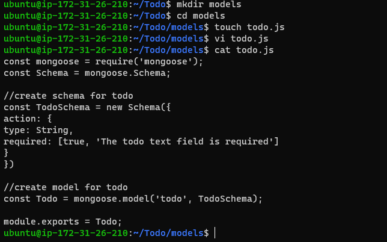
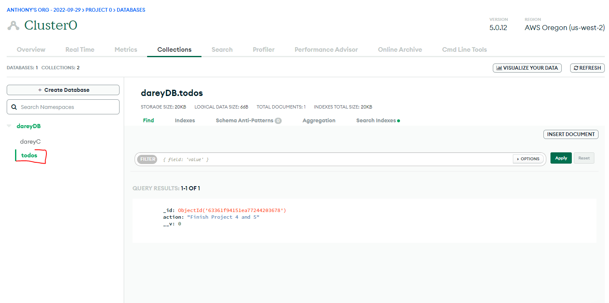

## AWS MERN WEB STACK IMPLEMENTATION

 This project shows how to implement a web solution on MERN stack in AWS Cloud

 MERN stands for (MongoDB, ExpressJS, ReactJS, Node.js,)

---
Creating EC2 Instance

---

We log on to AWS Cloud Services and create an EC2 Ubuntu Instance. When creating an instance, choose keypair authentication downloaded to local system.


## ................Backend Configuration.............

Update and Upgrade Ubuntu VM

**`sudo apt update && sudo apt upgrade -y`**


Lets get the location of Node.js software from Ubuntu repositories.

**`curl -fsSL https://deb.nodesource.com/setup_18.x | sudo -E bash -`**

## **Install Node.js on the server**

Install Node.js with the command below

**`sudo apt-get install -y nodejs`**


**Note: The command above installs both nodejs and npm. NPM is a package manager for Node like apt for Ubuntu, it is used to install Node modules & packages and to manage dependency conflicts.**


Verify the node installation with the command below

**`node -v`**


Verify the node installation with the command below

**`npm -v`**


## **Application Code Setup**

Create a new directory for your To-Do project:

**`mkdir Todo`**

Run the command below to verify that the Todo directory is created with ls command

**`ls`**

Inside the **Todo** directory we will instantiate our project using `npm init`. This enables javascript to install packages useful for spinning up our application.


Press Enter several times to accept default values, then accept to write out the package.json file by typing **yes**

Run the command ls to confirm that you have package.json file created.


## ................INSTALL EXPRESSJS................

Install ExpressJS

**`npm install express`**


Create a file index.js with te command below

**`touch index.js`**

Install the dotenv module

**`npm install dotenv`**


 
Open the index.js file with the command below

**`vi index.js`**

 
 Type the code below into it and save. Do not get overwhelmed by the code you see. For now, simply paste the code into the file.


```
const express = require('express');
require('dotenv').config();

const app = express();

const port = process.env.PORT || 5000;

app.use((req, res, next) => {
res.header("Access-Control-Allow-Origin", "\*");
res.header("Access-Control-Allow-Headers", "Origin, X-Requested-With, Content-Type, Accept");
next();
});

app.use((req, res, next) => {
res.send('Welcome to Express');
});

app.listen(port, () => {
console.log(`Server running on port ${port}`)
});

```

specified to use port 5000 in the code. This will be required later when we go on the browser.

Use :wq to save in vim

Now it is time to start our server to see if it works. Open your terminal in the same directory as your index.js file and type:

**`node index.js`**


We need to open port 5000 in EC2 Security Groups, like this


Open up your browser and try to access your server’s Public IP or Public DNS name followed by port 5000:


**`http://<PublicIP-or-PublicDNS>:5000`**


## Defining Routes For Our Applications

We will create a routes folder which will contain code pointing to the three main endpoints used in a todo application. This will contain the post,get and delete requests which will be helpful in interacting with our client_side and database via restful apis.

```
mkdir routes

cd routes

touch api.js
```

Open the file with the command below:

**`vi api.js`**

Copy and paste the code below:

```
const express = require ('express');
const router = express.Router();

router.get('/todos', (req, res, next) => {

});

router.post('/todos', (req, res, next) => {

});

router.delete('/todos/:id', (req, res, next) => {

})

module.exports = router;
```

## Creating Models

We will be creating the models directory which will be used to define our database schema. A Schema is a blueprint of how our database will be structured which include other fields which may not be required to be stored in the database.

Inside the `todo` directory, run `npm install mongoose` to install mongoose.

Create a `models` directory and then create a file in it `todo.js` Write the below code inside the todo.js file




we need to update our routes from the file api.js in ‘routes’ directory to make use of the new model.

In Routes directory, open `api.js` with vim api.js, delete the code inside with `:%d` command and paste there code below into it then save and exit


```
const express = require ('express');
const router = express.Router();
const Todo = require('../models/todo');

router.get('/todos', (req, res, next) => {

//this will return all the data, exposing only the id and action field to the client
Todo.find({}, 'action')
.then(data => res.json(data))
.catch(next)
});

router.post('/todos', (req, res, next) => {
if(req.body.action){
Todo.create(req.body)
.then(data => res.json(data))
.catch(next)
}else {
res.json({
error: "The input field is empty"
})
}
});

router.delete('/todos/:id', (req, res, next) => {
Todo.findOneAndDelete({"_id": req.params.id})
.then(data => res.json(data))
.catch(next)
})

module.exports = router;
```

## Creating MongoDB Database 

We will need a database to store all information when we make a post request to an endpoint. We will be using mLab which provides a DBaaS (Database as a service) solution.

For this we will make use of mLab which provides MongoDB as a service solution to create a cluster. 


Next, we add an IP Address choosing Anywhere

**Note** this is just for practicals/test


**Once IP address has been created go back to the cluster created and click on collections and select `Add my own data`**


Create a file in your Todo directory and name it .env.


**`touch .env`**

**`vi .env`**

Add the connection string to access the database in it, just as below:

**`DB = 'mongodb+srv://<username>:<password>@<network-address>/<dbname>?retryWrites=true&w=majority'`**

Ensure to update `<username>`, `<password>`, `<network-address>` and`<database>` according to your setup


Now we need to update the index.js to reflect the use of .env so that Node.js can connect to the database.

open the exsiting `index.js` and delete the content using `%d`, once that is done paste the code below:


```
const express = require('express');
const bodyParser = require('body-parser');
const mongoose = require('mongoose');
const routes = require('./routes/api');
const path = require('path');
require('dotenv').config();

const app = express();

const port = process.env.PORT || 5000;

//connect to the database
mongoose.connect(process.env.DB, { useNewUrlParser: true, useUnifiedTopology: true })
.then(() => console.log(`Database connected successfully`))
.catch(err => console.log(err));

//since mongoose promise is depreciated, we overide it with node's promise
mongoose.Promise = global.Promise;

app.use((req, res, next) => {
res.header("Access-Control-Allow-Origin", "\*");
res.header("Access-Control-Allow-Headers", "Origin, X-Requested-With, Content-Type, Accept");
next();
});

app.use(bodyParser.json());

app.use('/api', routes);

app.use((err, req, res, next) => {
console.log(err);
next();
});

app.listen(port, () => {
console.log(`Server running on port ${port}`)
});
```

Start your server using the command:

**`node index.js`**


## **Testing Backend Code Using Postman**


So far, we have built the backend of our application and in order to test to see if it works without a frontend, we use postman to test the endpoints.

On Postman, we make a POST request to our database whilst specifying an action in the body of the request.


Then We make a GET request to see if we can get back what has been posted into the database.





so at this stage we have tested the backend operation of out todo application and can confirm that it supports all 3 operations.

 - [Display a list of tasks – HTTP GET request]

 - [Add a new task to the list – HTTP POST request]
 
 - [Delete an existing task from the list – HTTP DELETE request]


 ## **Creating Frontend**

we are done with the functionality we want from our backend and API, it is time to create a user interface for a Web client (browser) to interact with the application via API. To start out with the frontend of the To-do app, we will use the `create-react-app` command to scaffold our app.

In the same root directory as your backend code, which is the Todo directory, run:

 **`npx create-react-app client`**

 

 This will create a new folder in your Todo directory called client, where you will add all the react code.


 **Running a React App**


Before testing the react app, there are some dependencies that need to be installed.

1. Install concurrently. It is used to run more than one command simultaneously from the same terminal window.

    **`npm install concurrently --save-dev`**

    

2. Install nodemon. It is used to run and monitor the server. If there is any change in the server code, nodemon will restart it automatically and load the new changes.

    **`npm install nodemon --save-dev`**

    

3. In Todo folder open the `package.json` file. Change the highlighted part of the below screenshot and replace with the code below.

```
"scripts": {
"start": "node index.js",
"start-watch": "nodemon index.js",
"dev": "concurrently \"npm run start-watch\" \"cd client && npm start\""
},
```

 


 Configure Proxy in package.json and Open the package.json file

 **`cd client`**

 **`vi package.json`**


Now, ensure you are inside the Todo directory, and simply do:

 **`npm run dev`**


 

 Your app should open and start running on localhost:3000

 **Important note: In order to be able to access the application from the Internet you have to open TCP port 3000 on EC2 by adding a new Security Group rule. You already know how to do it.**


**Creating your React Components**


One of the advantages of react is that it makes use of components, which are reusable and also makes code modular. For our Todo app, there will be two stateful components and one stateless component.

From your Todo directory run

**`cd client`**


move to the src directory

**`cd src`**

Inside your src folder create another folder called components

**`mkdir components`**

Move into the components directory with

**`cd components`**

Inside ‘components’ directory create three files Input.js, ListTodo.js and Todo.js.

**`touch Input.js ListTodo.js Todo.js`**


Open Input.js file


**`vi Input.js`**


Copy and paste the following

```
import React, { Component } from 'react';
import axios from 'axios';

class Input extends Component {

state = {
action: ""
}

addTodo = () => {
const task = {action: this.state.action}

    if(task.action && task.action.length > 0){
      axios.post('/api/todos', task)
        .then(res => {
          if(res.data){
            this.props.getTodos();
            this.setState({action: ""})
          }
        })
        .catch(err => console.log(err))
    }else {
      console.log('input field required')
    }

}

handleChange = (e) => {
this.setState({
action: e.target.value
})
}

render() {
let { action } = this.state;
return (
<div>
<input type="text" onChange={this.handleChange} value={action} />
<button onClick={this.addTodo}>add todo</button>
</div>
)
}
}

export default Input
```

To make use of Axios, which is a Promise based HTTP client for the browser and node.js, you need to cd into your client from your terminal and run yarn add axios or npm install axios.

Move to the src folder

**`cd ..`**

Move to clients folder

**`cd ..`**

Install Axios


**`npm install axios`**


Go to ‘components’ directory


**`cd src/components`**


After that open your ListTodo.js


**`vi ListTodo.js`**


in the `ListTodo.js` copy and paste the following code


```
import React from 'react';

const ListTodo = ({ todos, deleteTodo }) => {

return (
<ul>
{
todos &&
todos.length > 0 ?
(
todos.map(todo => {
return (
<li key={todo._id} onClick={() => deleteTodo(todo._id)}>{todo.action}</li>
)
})
)
:
(
<li>No todo(s) left</li>
)
}
</ul>
)
}

export default ListTodo
```


Then in your `Todo.js` file you write the following code
```
import React, {Component} from 'react';
import axios from 'axios';

import Input from './Input';
import ListTodo from './ListTodo';

class Todo extends Component {

state = {
todos: []
}

componentDidMount(){
this.getTodos();
}

getTodos = () => {
axios.get('/api/todos')
.then(res => {
if(res.data){
this.setState({
todos: res.data
})
}
})
.catch(err => console.log(err))
}

deleteTodo = (id) => {

    axios.delete(`/api/todos/${id}`)
      .then(res => {
        if(res.data){
          this.getTodos()
        }
      })
      .catch(err => console.log(err))

}

render() {
let { todos } = this.state;

    return(
      <div>
        <h1>My Todo(s)</h1>
        <Input getTodos={this.getTodos}/>
        <ListTodo todos={todos} deleteTodo={this.deleteTodo}/>
      </div>
    )

}
}

export default Todo;
```

We need to make little adjustment to our react code. Delete the logo and adjust our App.js to look like this.


Move to the src folder

**`cd ..`**


Make sure that you are in the src folder and run

**`vi App.js`**


Copy and paste the code below into it

```
import React from 'react';

import Todo from './components/Todo';
import './App.css';

const App = () => {
return (
<div className="App">
<Todo />
</div>
);
}

export default App;
```


After pasting, exit the editor.

In the src directory open the App.css

**`vi App.css`**


Then paste the following code into App.css:

```
.App {
text-align: center;
font-size: calc(10px + 2vmin);
width: 60%;
margin-left: auto;
margin-right: auto;
}

input {
height: 40px;
width: 50%;
border: none;
border-bottom: 2px #101113 solid;
background: none;
font-size: 1.5rem;
color: #787a80;
}

input:focus {
outline: none;
}

button {
width: 25%;
height: 45px;
border: none;
margin-left: 10px;
font-size: 25px;
background: #101113;
border-radius: 5px;
color: #787a80;
cursor: pointer;
}

button:focus {
outline: none;
}

ul {
list-style: none;
text-align: left;
padding: 15px;
background: #171a1f;
border-radius: 5px;
}

li {
padding: 15px;
font-size: 1.5rem;
margin-bottom: 15px;
background: #282c34;
border-radius: 5px;
overflow-wrap: break-word;
cursor: pointer;
}

@media only screen and (min-width: 300px) {
.App {
width: 80%;
}

input {
width: 100%
}

button {
width: 100%;
margin-top: 15px;
margin-left: 0;
}
}

@media only screen and (min-width: 640px) {
.App {
width: 60%;
}

input {
width: 50%;
}

button {
width: 30%;
margin-left: 10px;
margin-top: 0;
}
}
Exit
```


In the src directory open the index.css

**`vim index.css`**

Copy and paste the code below:

```
body {
margin: 0;
padding: 0;
font-family: -apple-system, BlinkMacSystemFont, "Segoe UI", "Roboto", "Oxygen",
"Ubuntu", "Cantarell", "Fira Sans", "Droid Sans", "Helvetica Neue",
sans-serif;
-webkit-font-smoothing: antialiased;
-moz-osx-font-smoothing: grayscale;
box-sizing: border-box;
background-color: #282c34;
color: #787a80;
}

code {
font-family: source-code-pro, Menlo, Monaco, Consolas, "Courier New",
monospace;
}
```

Go to the Todo directory

**`cd ../..`**


When you are in the Todo directory run:


**`npm run dev`**

Assuming no errors when saving all these files, our To-Do app should be ready and fully functional with the functionality discussed earlier: creating a task, deleting a task and viewing all your tasks.


