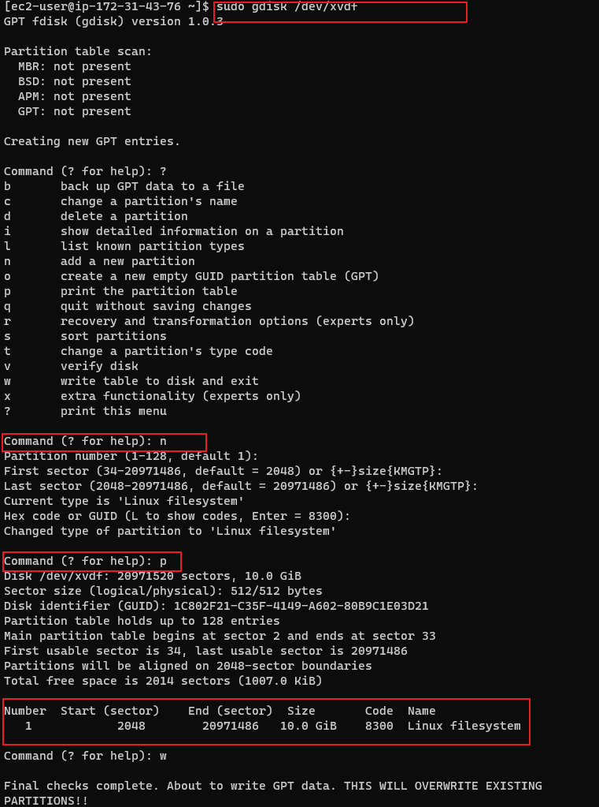
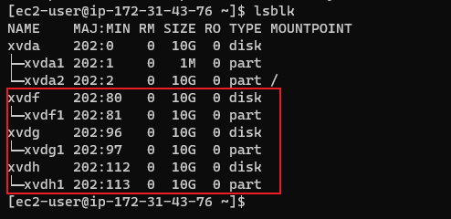
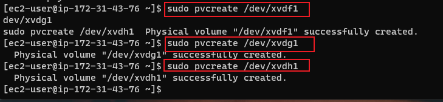
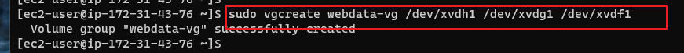

# Implementing-Wordpress-Web-Solution


Three-tier Architecture
Generally, web, or mobile solutions are implemented based on what is called the Three-tier Architecture.

Three-tier Architecture is a client-server software architecture pattern that comprise of 3 separate layers.

Your 3-Tier Setup

* A Laptop or PC to serve as a client
* An EC2 Linux Server as a web server (This is where you will install WordPress)
* An EC2 Linux server as a database (DB) serve


1. **Create an AWS instance using RedHat Distribution**

The EC2 instance will serve as a Web Server, create 3 volumes in the same AZ as the Web Srver EC2, each of 10GB.


2. **Attach the three volumes one by one to your Webserver EC2 instance


3. Open up the Linux terminal to begin configuration

4. Use `lsblk` command to inspect what block devices are attached to the server. Notice names of your newly created devices. All devices in Linux reside in `/dev/` directory. Inspect it with ls /dev/ and make sure you see all 3 newly created block devices there – their names will likely be `xvdf`, `xvdh`, `xvdg.`


5. Use `df -h` command to see all mounts and free space on your server


6. Use `gdisk` utility to create a single partition on each of the 3 disks

**`sudo gdisk /dev/xvdf`**



7. Use `lsblk` utility to view the newly configured partition on each of the 3 disks.




8. Install lvm2 package using `sudo yum install lvm2`. Run `sudo lvmdiskscan` command to check for available partitions.


9. Use `pvcreate` utility to mark each of 3 disks as physical volumes (PVs) to be used by LVM.




10. Use `vgcreate` utility to add all 3 PVs to a volume group (VG). Name the VG **webdata-vg**

**`sudo vgcreate webdata-vg /dev/xvdh1 /dev/xvdg1 /dev/xvdf1`**




11. verify that VG has been created 


12. Use `lvcreate` utility to create 2 logical volumes. **apps-lv (Use half of the PV size), and logs-lv Use the remaining space of the PV size**. NOTE: apps-lv will be used to store data for the Website while, logs-lv will be used to store data for logs.

```
sudo lvcreate -n apps-lv -L 14G webdata-vg
sudo lvcreate -n logs-lv -L 14G webdata-vg
```

13. Verify that your Logical Volume has been created successfully by running sudo lvs


14. Verify the entire setup


15. Use `mkfs.ext4` to format the logical volumes with `ext4` filesystem

```
sudo mkfs -t ext4 /dev/webdata-vg/apps-lv
sudo mkfs -t ext4 /dev/webdata-vg/logs-lv
```

16. Create /var/www/html directory to store website files

**`sudo mkdir -p /var/www/html`**


17. Create /home/recovery/logs to store backup of log data


**`sudo mkdir -p /home/recovery/logs`**


18. Mount /var/www/html on apps-lv logical volume


**`sudo mount /dev/webdata-vg/apps-lv /var/www/html/`**


19. Use rsync utility to backup all the files in the log directory /var/log into /home/recovery/logs (This is required before mounting the file system)


**`sudo rsync -av /var/log/. /home/recovery/logs/`**


20. Mount /var/log on logs-lv logical volume. (Note that all the existing data on /var/log will be deleted. That is why step 15 above is very
important)


**`sudo mount /dev/webdata-vg/logs-lv /var/log`**


21. Restore log files back into /var/log directory


**`sudo rsync -av /home/recovery/logs/. /var/log`**


22. Update /etc/fstab file so that the mount configuration will persist after restart of the server.


